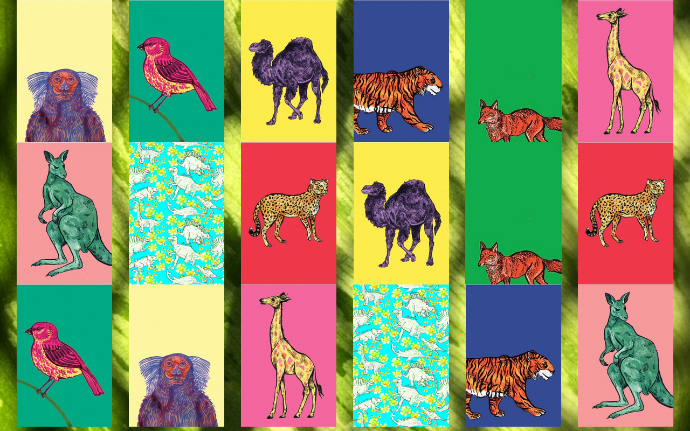
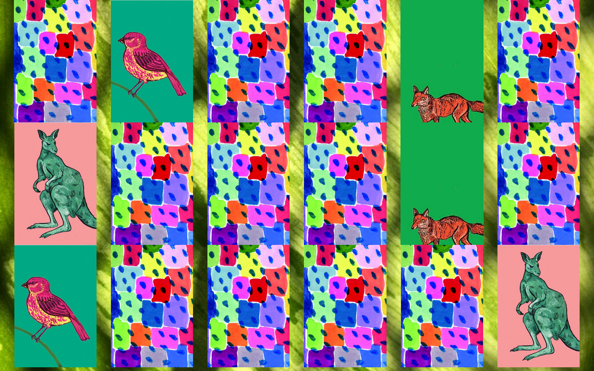
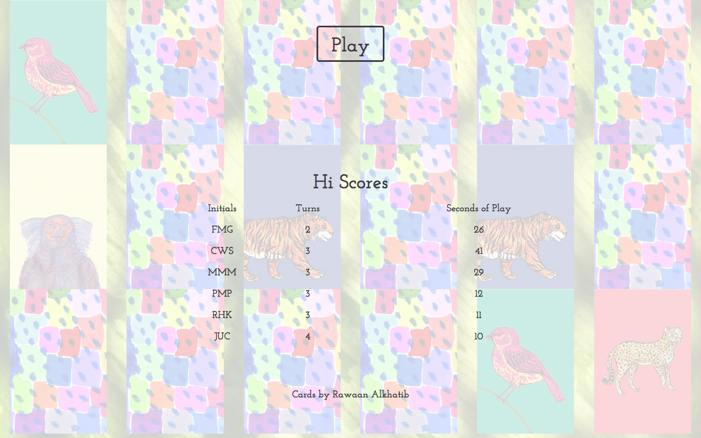

# Memory Cards
#### A card matching game for children and child-like adults in a sunny glade full of wild animals, some extinct.
---------
#### My plan is to implement this game in a few different frameworks, as a way to extend my knowledge. So far, only the backbone version is active.

# Backbone Version:
* ### The stack:
  * __postgresql__ - to persist high scores.
  * __express__ - a lightweight server.
  * __backbone__ - for a sturdy front-end

* ### Other technologies:
  * __bootstrap__ - for a responsive grid.
  * __less__ - to ease the displeasure of css.
  * __gulp__ - to build js and css files.
  * __pg__ - to connect node to the postgres database.

* ### Screenshots:

